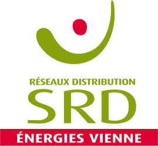

.. note::

   This project and page is under active development.

         

         

Welcome to SRD-ORI documentation!
=================================

Welcome to the official documentation of the `ODRI project <https://www.s2e2.fr/projets/odri/>`_  fifth axe **ORI** (Offre de Racordement Intelligente) or Flexible connexion proposal. 

-----------

------------
 
ORI's main goal is to provide tools to help `SRD <https://www.srd-energies.fr/>`_ decide in which specificities an ORI should be proposed to new renewable energy producers demanding to be connected to the electric distribution Network. 

This documentation offers an in-depth view of the main functions used in the tutorials accessible in the folder `~/Ressources/Notebooks/ <https://github.com/pajjaecat/ORI-SRD/tree/main/Ressources/Notebooks>`_ of the  `project's GitHub <https://github.com/pajjaecat/ORI-SRD/tree/main>`_. 

Check out the :doc:`usage` section for further information, including
how to :ref:`installation` the project.

Contents
--------

.. toctree::
   :maxdepth: 2

   Home <self>
   howToUse
   orivariables
   orifunctions
   oriclasses
   api
